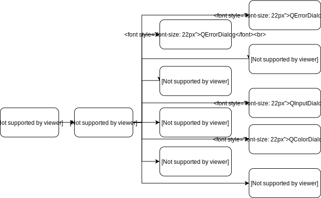

# 窗体小部件

## 创建Qt程序

c++```
#include <QApplication>
int main(int argc, char *argv[])
{
    QApplication app(argc,argv);
    return app.exec();
}
```

## QWidget QMainWindow QDialog

这3个基类从名字上看分别是 "微件"、"对话框"、"主窗口，
QWidget类是所有用户界面对象的基类，QMainWindow和QDialog都是QWidget的子类。窗口部件是用户界面的一个基本单元：它从窗口系统接收鼠标、键盘和其它事件，并且在屏幕上绘制自己。每一个窗口部件都是矩形的，并且它们按Z轴顺序排列。一个窗口部件可以被它的父窗口部件或者它前面的窗口部件盖住一部分。

    QMainWindow 类提供一个有菜单条、锚接窗口（例如工具条）和一个状态条的主应用程序窗口。主窗口通常用在提供一个大的中央窗口部件（例如文本编辑或者绘制画布）以及周围 菜单、工具条和一个状态条。QMainWindow常常被继承，因为这使得封装中央部件、菜单和工具条以及窗口状态条变得更容易，当用户点击菜单项或者工具条按钮时，槽会被调用。

    QDialog类是对话框窗口的基类。对话框窗口是主要用于短期任务以及和用户进行简要通讯的顶级窗口。QDialog可以是模态对话框也可以是非模态对话框。QDialog支持扩展性并且可以提供返回值。它们可以有默认按钮。QDialog也可以有一个QSizeGrip在它的右下角，使用setSizeGripEnabled()。

    QDialog 是最普通的顶级窗口。一个不会被嵌入到父窗口部件的窗口部件叫做顶级窗口部件。通常情况下，顶级窗口部件是有框架和标题栏的窗口（尽管使用了一定的窗口部件标记，创建顶级窗口部件时也可能没有这些装饰。）在Qt中，QMainWindow和不同的QDialog的子类是最普通的顶级窗口。

    如果是顶级对话框，那就基于QDialog创建，如果是主窗体，那就基于QMainWindow，如果不确定，或者有可能作为顶级窗体，或有可能嵌入到其他窗体中，则基于QWidget创建。
    当然了，实际中，你还可以基于任何其他部件类来派生。看实际需求了，比如QFrame、QStackedWidget等等。

    在Qt中，我们将窗口和控件统称为Widget；
    窗口是指程序的整体界面，可以包含标题栏，菜单栏，工具栏，关闭按钮，最小化按钮，最大化按钮等；
    控件是指按钮，复选框，文本框，表格，进度条等这些组成程序的基本元素。
    一个程序可以有多个窗口，一个窗口也可以有多个控件；
    QWidget是所有用户界面元素的基类，窗口和控件都是直接或间接继承自QWidget。QMainWindow，QWidget，QDialog三个类就是用来创建窗口的，可以直接使用也可以继承后再使用。
    QMainWindow窗口可以包含菜单栏，工具栏，状态栏，标题栏等，是最常见的窗口形式，可以作为GUI程序的主窗口。
    QDialog是对话框的基类。对话框主要用来执行短期任务，或与用户进行互动，它可以是模态也可以是非模态的。QDialog没有菜单栏，工具栏，状态栏等；
    如果是主窗口，就使用QMainWindows；如果是对话框，就是用QDialog；如果不确定，或有可能作为顶级窗口，也有可能嵌入到其他窗口中，那么使用QWidget;

>>需要注意的是，窗口和控件都继承自QWidget，如果不为控件指定父对象，它就会被作为窗口处理，这时setWindowsTitle()和setWindowIcon()函数就会生效；

窗口(Window)和窗口部件(Widget)

本书中,多次使用了窗口和窗口部件的概念。把一个图形用户界面称为窗口,它往往具有标题栏、窗口边框(frame)、能够通过鼠标拖动和改变大小等特性,最典型的窗口就是
对话框。例如,第一个Qt应用程序的用户界面就是一个窗口。当文中使用窗口的时候,就是特指这种情况。一般的,窗口部件是对所有图形用户界面的统称,它既可以作为单独的窗口出现,也可以出现在一个窗口的内部。

### 新建窗口

```c++
QWidget * widget = new QWidget();
```

### 新建控件

* 第一种控件创建

```c++
QWidget *cornerWidget = new QWidget;//new widget
cornerWidget->setMinimumSize(400,420);//设置窗口尺寸
cornerWidget->setMaximumSize(400,420);
cornerWidget->show();

QLabel * label1 = new QLabel;
label1->setText("Hello");//设置控件文本
QString text = label1->Text("Hello");//获取控件文本
label1->setParent(cornerWidget);//设置父窗口

label1->setGeometry(50,50,80,80);//设置位置
```

* 第二种控件创建

```c++
QLabel * label2 = new QLabel("shane",cornerWidget);//创建控件，添加文本，设置父窗口
QPushButton * btn1 = new QPushButton("I am button",cornerWidget)

label2->setGeometry(50,50,80,80);
label2->move(210,210);
label2->resize(90,200);
```

* 发送按钮控件的文本

使用Qt的信号机制就可以获取发送点击事件的按钮上的文字了。下面这个语句很常用：

```c++
QString text = ((QPushButton*)sender())->text();
```

### 窗口居中显示

Qt 设置窗口居中显示

方法一：在窗口(QWidget类及派生类)的构造函数中添加如下代码：

```c++
#include <QDesktopWidget>

//.......
QDesktopWidget* desktop = QApplication::desktop(); // =qApp->desktop();也可以
move((desktop->width() - this->width())/2, (desktop->height() - this->height())/2);
//.......

重新编译后，该窗口启动时在屏幕居中的位置。
```

方法二：在调用show()函数后调用move()函数,j将窗口移动到屏幕中央。

```c++
#include <QDesktopWidget>

int main(int argc, char *argv[])
{
    QApplication a(argc, argv);
    MainWindow w;
    w.show();
    w.move ((QApplication::desktop()->width() - w.width())/2,(QApplication::desktop()->height() - w.height())/2);
    return a.exec();
}
```

## 对话框——QDialog

### 对话框继承方式



## QComboBox

QComboBox部件是一个组合的按钮和弹出列表,提供了一种向用户呈现选项列表的方式，其占用最小量的屏幕空间。组合框是一个显示当前项目的选择小部件，可以弹出可选项目列表。组合框可以是可编辑的，允许用户修改列表中的每个项目。组合框可以包含图像以及字符串； 当然insertItem()和setItemText()函数需要适当重载。对于可编辑组合框，提供了函数clearEditText()，以清除显示的字符串而不更改组合框的内容。如果组合框的当前项目发生更改，则会发出两个信号currentIndexChanged()和activated()。无论以编程方式或通过用户交互完成更改，currentIndexChanged()总是被发射，而只有当更改是由用户交互引起时才activated() 。highlighted()信号在用户突出显示组合框弹出列表中的项目时发出。所有三个信号都有两个版本，一个带有str参数，另一个带有int参数。如果用户选择或突出显示一个图像，则只会发出int信号。每当可编辑组合框的文本发生改变时，editTextChanged()信号就会发出。当用户在可编辑的组合框中输入一个新的字符串时，该小部件可能会插入它，也可能不会插入它，并且可以将它插入到多个位置。默认策略是InsertAtBottom，但您可以使用setInsertPolicy()更改它。可以使用QValidator将输入约束为可编辑的组合框；请参阅setValidator()。默认情况下，接受任何输入。例如，可以使用插入函数insertItem()和insertItems()来填充组合框。可以使用setItemText()更改项目。一个项目可以使用removeItem()来移除，所有项目都可以使用clear()来移除。当前项目的文本由currentText()返回，项目的文本编号使用text()返回。当前项目可以使用setCurrentIndex()来设置。 count()返回组合框中的项目数；可以用setMaxCount()设置项目的最大数量。您可以允许使用setEditable()进行编辑。对于可编辑组合框，您可以使用setCompleter()设置自动完成，并且用户是否可以添加重复项由setDuplicatesEnabled()进行设置。QComboBox为其弹出列表使用模型/视图框架并存储其项目。默认情况下，QStandardItemModel存储项目，QListView子类显示弹出列表。您可以直接访问模型和视图（使用model()和view()），但QComboBox还提供了设置和获取项目数据的函数（例如，setItemData()和itemText()）。您还可以设置新的模型和视图（使用setModel()和setView()）。对于组合框标签中的文本和图标，将使用具有Qt.DisplayRole和Qt.DecorationRole的模型中的数据。请注意，您不能通过使用setSelectionMode()来更改view()的SelectionMode。
类归属。

```c++
//[Qcombox]
QComboBox * combox= new QComboBox;
QPushButton * pb = new QPushButton;
QLabel * lbl = new QLabel;

combox->addItem(pb);
combox->addItem(lbl);
combox->insertItem();
//[QCombox]
```
