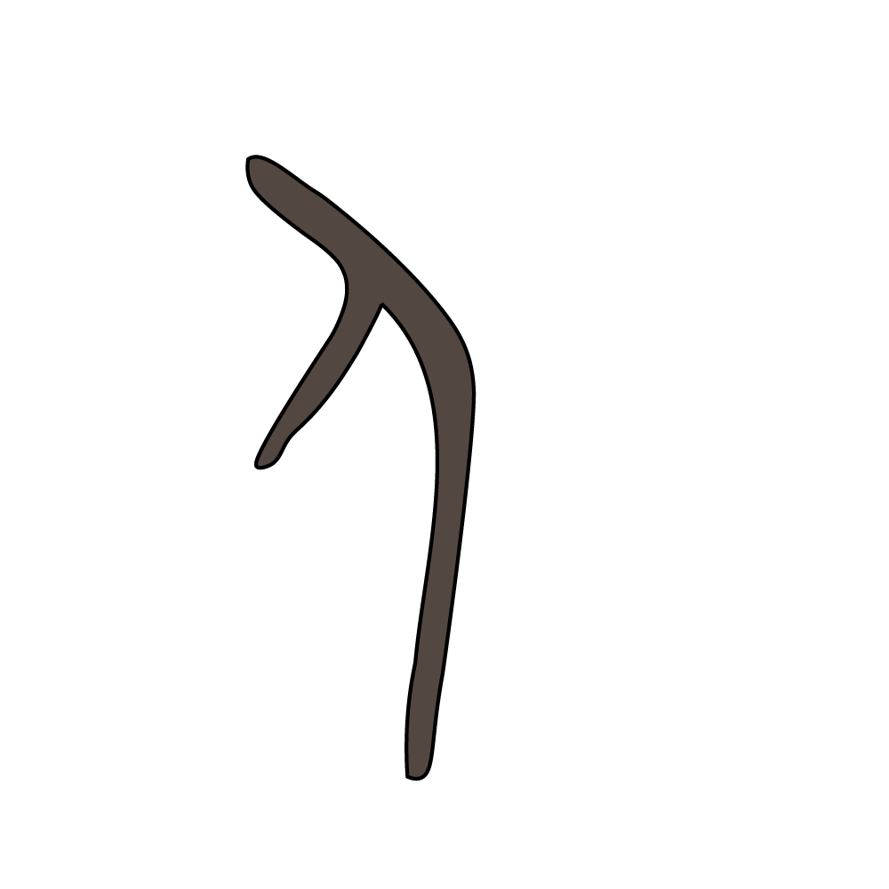
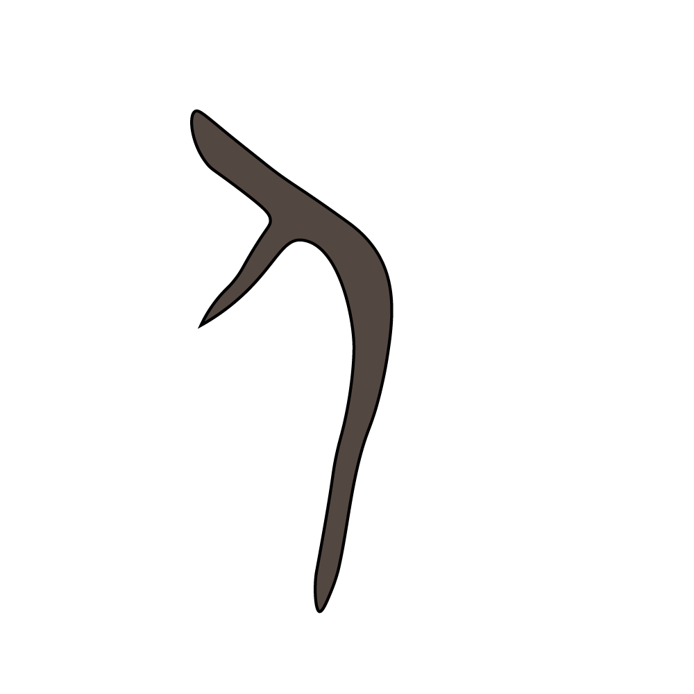
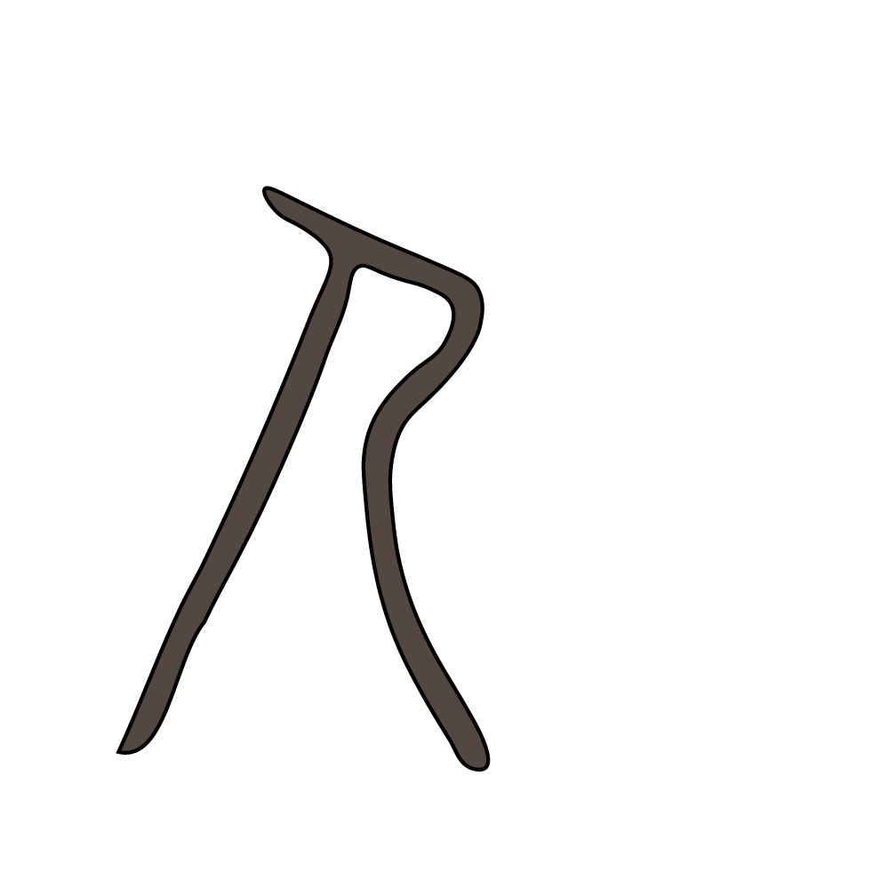

# 人族

## 人

我是谁？我从哪里来？又到哪里去？这号称三大哲学问题难倒了古往今来的多少过客，抛开这么深奥枯涩的话题不谈，我们来看看古人是如何描述作为人类整体的部分的自己的。“人”字最早的字形为甲骨文。从形状来看，是一个双手微伸，身体前倾的人的侧面投影。

<figure>

<figcaption>甲骨文-人</figcaption>
</figure>

<figure>

<figcaption>金文-人</figcaption>
</figure>

金文延续了甲骨文的形貌。

<figure>

<figcaption>金文-人</figcaption>
</figure>

篆体是一个突出了弯腰垂臂、脸朝黄土背朝天的劳作形象，像是双手采摘或在地里忙活。

<figure>

<figcaption>篆文-人</figcaption>
</figure>

