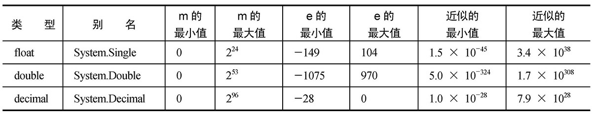

# 变量和表达式

主要介绍C#的基本语法，变量，表达式等知识。

[下载地址](http://www.wrox.com/go/beginningvisualc#2015programming)

## 1 基本语法

C#编译器不考虑代码中的空格、 回车符或制表符（这些字符统称为空白字符）。

> 注意： 在能通过Tools|Options访问的VS Options对话框中， 显示了VS用于格式化代码的规则。 在Text Editor|C#|Formatting节点的子类别下， 包含了其中很多规则。

## 2 注释与代码折叠

### 2.1  C#的注释

```c#
/* 此处是注释          comment 1*/
int a = 23;  //a->23  comment 2
a = 12;     ///       comment 3
```

> 正常情况下，编译器会忽略它们，就像其他注释一样，但可以通过配置VS，在编译项目时，提取这些注释后面的文本，创建一个特殊格式的文本文件，该文件可用于创建文档。为了创建文档，注释必须遵循XML文档的规则，详见[网页](https://msdn.microsoft.com/library/aa288481.aspx)。

### 2.2代码折叠

使用region和#endregion关键字来定义可以展开和折叠的代码区域的开头和结尾。

## 3 变量

声明变量的C#语法 type name;

### 3.1 简单类型

数值和布尔型

|类型| 别名 |允许的值
-|-|-
sbyte |System.SByte | 介于–128和127之间的整数
byte  |System.Byte  | 介于0和255之间的整数
short |System.Int16 | 介于–32 768和32 767之间的整数
ushort|System.UInt16| 介于0和65 535之间的整数
int   |System.Int32 | 介于–2 147 483 648和2 147 483 647之间的整数
uint  |System.UInt32| 介于0和4 294 967 295之间的整数
long  |System.Int64 | 介于–9 223 372 036 854 775 808和9 223372 036 854 775 807之间的整数
ulong |System.UInt64| 介于0和18 446 744 073 709 551 615之间的整数

可以使用的浮点数变量类型有3种：float、double和decimal。前两种可以用+/–m×2e 的形式存储浮点数，m和e的值因类型而异。decimal使用另一种形式：+/–m×10e。



类型|别名|允许的值
-|-|-
char  | System.Char    | 一个Unicode字符，存储0和65 535之间的整数
bool  | System.Boolean | 布尔值：true或false
string| System.String  | 一组字符

Console.WriteLine($"{myString} {myInteger}");这是C# 6中的一个新功能，称为字符串插入。

Console.ReadKey();这里不详细探讨这行代码，但后面的示例会常常用到它。现在只需要知道，它暂停代码的执行，等待用户按下一个键。用于在程序结束前等待用户输入内容。

### 3.2 变量命名

* 变量名的第一个字符必须是字母、下划线(_)或@。
* 其后的字符可以是字母、下划线或数字。

### 3.3 表达式
