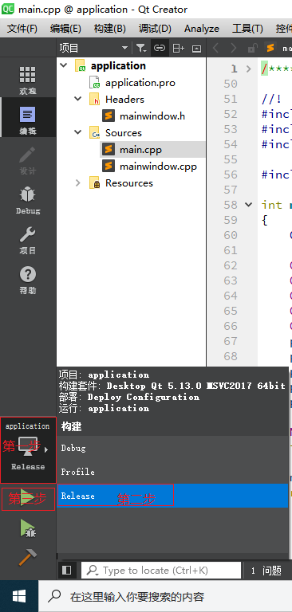

# Qt程序打包发布

## 背景介绍 

Qt 官方开发环境使用的动态链接库方式，在发布生成的exe程序时，需要复制一大堆dll，如果自己去复制dll，很可能丢三落四，导致exe在别的电脑里无法正常运行。因此 Qt 官方开发环境里自带了一个工具：windeployqt.exe。
以官方 Qt 5.4.0+MinGW 开发环境为例，windeployqt工具在 %QTDIR%\Qt5.4.0\5.4\mingw491_32\bin 目录下，其中 QTDIR 是 Qt 的安装目录，是环境变量。

## 发布

在集成开发环境 QtCreator 中可选择 "Qt Widgets Application" 或 "Qt Quick Application" 两种方式生成图形界面应用程序。

### Qt Widgets Application 发布

将 QtCreator 新建的 Qt Widgets Application 项目，项目名字假定是 Application。然后以 Release 方式编译生成 exe 程序：



生成的程序运行正常之后，找到项目的生成目录，进入这个文件夹，在进入它的子文件夹 release 里面，将 Application.exe 复制到一个新的单独的文件夹。然后从开始菜单打开 Qt 命令行，进入相应文件夹。

然后使用 windeployqt 工具命令：

```cmd
windeployqt Application.exe
```

至此，文件夹里看到 windeployqt 工具自动复制的插件文件夹和 dll文件、qm文件。这时候得到的就完整的 exe 程序发布集合，依赖关系都解决好了。

### Qt Quick Application 方式

以上步骤同上

```cmd
windeployqt helloqml.exe --qmldir C:\Qt\Qt5.4.0\5.4\mingw491_32\qml
```
--qmldir 是指出 Qt 库里面的 qml 文件夹位置，上面命令里 C:\Qt\Qt5.4.0 是 Qt 官方开发环境安装的文件夹，C:\Qt\Qt5.4.0\5.4\mingw491_32 是Qt类库的目录（QTDIR），因此使用的 --qmldir 后面写的是 C:\Qt\Qt5.4.0\5.4\mingw491_32\qml ，读者Qt环境安装路径不一样，要根据实际情况修改！
