# 平面构成笔记

## 1 绪论

平面构成起源于1919年德国包豪斯学院的设计课程改革，包豪斯所奠定的设计思想和风格摆脱了纯艺术的目的，把丰富的设想与精湛的技术结合起来为现实问题服务。平面构成是将各种形态要素按照一定的美学原则在二维平面上进行创造性的组合，作为艺术设计院校的一门基础课程，与色彩构成、立体构成并称为三大构成。

### 1.2 何谓平面构成

平面”，是针对我们的三维生活空间而言的二维空间概念，在二维空间完成的造型艺术设计的种类与样式很多，也就是我们时下所说的“平面设计”，如报纸杂志、书籍印刷、商品的标志、包装上的图案等。

“构成”，字面意思有“组织、重合、组装”等含义。“构”的原意是“筑土构木以为宫室”，也就是说“构”的本意是使某一形体或者器物成型，其内部支撑起骨架，因而后来发展成建立、缔造、结成、造成、构思、草拟、缀合、组合、构图、构词等相关的含义。“成”，其延伸含义为成就、成熟、形成、完成、成全等含义。构成是指为完善目标所做的建设性活动，这里特指与视觉艺术形式相关的造型活动。

平面构成是指将视觉元素的既有形态（包括具象形态，抽象形态—点、线、面、体），在二维平面上，按照一定的秩序和法则进行分解组合，以形成理想形态的设计体系，是研究形象与形象之间排列的方法。

### 1.3 平面构成的研究对象

平面构成研究的内容包括三个方面。

1. 对于抽象形象的理解，学会分析各种形象的结构、特征，掌握形象变化的过程，并完成对具象形象提炼，用点、线、面的语言重新构成抽象形象；
2. 对美的原理和形式法则的理解，并进一步尝试对它的展开与应用；
3. 理解空间与形象、形象与形象的关系，并能将其关系运用于实际设计作品。

## 2 平面构成基本要素

道生一，一生二，二生三，三生万物。
点移成线->线移成面->面动成体。
世界上存在的各种物质都可以概括为最基本的元素——点、线、面。

### 2.1 点

它是一种具有空间位置的视觉单位。点只表示位置，不具有大小，既无长度也无宽度，是最小的单位。在平面构成中，点是一个相对的概念，在比较中存在，并通过比较而显现。

康定斯基说过，“点可以具有无穷多的形状，只要其足够小就可以”。在大千世界中随处都可以看到点状的形象，也就是说自然界的物体只要缩小到一定程度都可以看成是点的形态。点的形状可以分为两类：一是几何形的点，如圆形、方形、三角形、五边形、六边形、扇形等，特点是形状规则、均匀稳定、富于现代感；二是任意自然形态中的点，特点是形状自由、千变万化、富于人情味。点没有一个特定的形象标准，形成点的因素与形状无关，点的形状随感情而变化，与大小、空间有关（如图2-3所示）。

#### 2.1.1 点的情绪

点具有聚集的效果，点的不同数量、形态和位置都给人带来不同的情绪感受，不同的点有不同的情感表达。

1.点的心理特征
（1）单点　点是视觉中心，也是力的中心，当画面中只有一个点时，人们的视线就集中到这个点上。单独的点往往有着很强的视觉吸引力，能够产生积聚力的视觉效果。当画面中出现两个点时，就会出现长度和方向感，形成一种视觉张力的力量感。
画面中只有一个点并居中时，画面具有稳定感和集中感，视觉中心突出。点的位置一旦移动，画面的动感就开始产生；当点处于画面三分之二处时，它的视觉冲击力最强，最能吸引人的眼球，当点处于画面上方时，有下落的感觉；当点处于上方某一侧时，就会产生强烈的不安定感；当点处于画面下方且左右对称时，重心下移，给人以安定感；随着点向下方左右移动时，画面就会在安定中产生动感，空间也发生变化。

（2）两点　在空间中有两个大小相同的点，并相距一定的距离时，便产生长度感和方向性，也就产生一种特殊的张力，这种视觉张力会引导视觉移动，形成视觉流程。
（3）多点　如果画面中出现了三个或三个以上的点时，称之为多点。这时画面的视觉张力就会更加丰富，视觉流程同样会引导我们在这三个点中发现暗含联系，会出现一个隐约可见的面，当画面中的点越多，这个虚化的面的轮廓就更清晰，这个面就从暗含走向了灰空间，进而真实的面就越来越接近。所以，多点是形象产生的基础，多点可以设计出特别复杂的表现形式，利用点的大小来表现，会形成强烈的方向感。

#### 2.1.2 点的错视

所谓“错视”，就是感觉与客观事物不一致的现象。在画面里点受到一定环境背景的影响，点所处的位置随着其色彩和环境条件的变化，便会产生远近、大小等变化的错觉。

① 白色背景里的黑点会比黑色背景里的白点显得小，一般明亮的暖色会接近眼睛，有一种前进感和膨胀感。白点有扩张感，黑点有收缩感。橘色的点要比蓝色的点感觉大，在设计中我们可以采用明亮的色彩来突出主题内容，同时使用较暗的冷色减弱次要部分的字或图形。
② 同一大小的两个点，由于其周围点大小的不同，会产生不同大小的错觉（如图2-6所示）。
③ 同一大小的两个点，由于空间对比关系的作用，给人的大小视觉感受也不一样（如图2-7所示）。
④ 在两条直线的夹角中，同一大小的两个点，由于其位置的不同，距离尖端的远近不同，给人的大小的感觉也不一样，靠近角尖之点有大的感觉。

#### 2.1.3 点的构成

（1）点的规律构成　点的规律构成是指点的形状、面积、位置和方向等因素，依照一定的规律排列组合，既可以是重复的，又可以是渐变的。点可以通过疏密排列组合形成空间中的图形，同时有规律的点的排列组合也会产生丰富的空间变化。
（2）点的自由构成　点的自由构成是指点的形状、面积、位置和方向等因素，以自由和非规律的形式排列组合，往往会形成均衡美观的效果。
（3）点的线化构成　点的线化构成是指以点为基本单位进行有序的排列，在点与点的排列中给人以线的感觉。
（4）点的面化构成　点的面化构成是指将点在线化的基础上进行移动，聚集的点就形成了面。

### 2.2 线

线是点移动的轨迹，线带有明确的方向性。在几何学上线只有位置、长度而不具有宽度和厚度，但是作为视觉形象的线，不仅具有长短、方向、位置，还具有粗细，线与点一样成为视觉元素中不可取代的表现力。线在我们的设计中常常用来引导观者的视线，线随着方向的不断改变呈现出丰富的视觉效果

#### 2.2.1 线的情绪

在艺术设计中，线不仅有宽度还会产生丰富的变化，形状不同的线还会产生多变的感情形态。
1．线的心理特征
线概括起来分为两大类：直线和曲线。
（1）直线　在构成作品中，直线给人以速度感、紧张感、锐利而简洁，从生理和心理上，直线的直率、简单，给人以刚直的男性象征，有一种力量美。直线有具有粗细和长短之分，从视觉感官上来讲，细线具有速度、敏锐、微弱、紧张感；粗线具有粗犷、豪爽、阳刚、厚重、粗笨的感觉；长线具有时间性和持续性；短线具有间断性和迟缓性。
（2）曲线　曲线有几何曲线和自由曲线之分。曲线具有女性特征，有感性、轻快、优雅、速度、丰满之感。几何曲线具有规范、准确、冷静、单纯、明快的视觉效果，几何曲线包括圆、椭圆、圆弧、抛物线等。自由曲线具有随意、偶然、自由奔放的感觉。

#### 2.2.2 线的错视

线的错视是指画面中的线条的形态会受到视觉的作用，产生与客观事物不符的现象。
① 两条等长的水平直线，由于线段端头加入不同方向的斜线，因斜线与线段形成角度的不同，线段便会产生不等长的视错觉（如图2-15所示）。
② 画面中两条直线，垂直方向的直线比被分割成两段的水平直线感觉长（如图2-16所示）。
③ 一条斜向的直线，被两条平行的直线断开，斜线会产生不在一条直线上的错觉（如图2-17所示）。
④ 两条平行直线在交叉斜线的背景下扭曲会产生错视，直线出现了凹陷的弯曲感。另外一组的直线产生了外凸的弯曲感（如图2-18～图2-20所示）。

#### 2.2.3 线的构成

线的自由构成是指不同粗细、曲直、疏密的线条作无秩序自由变化的排列组合。线的自由构成往往会形成变化、跳跃、活泼的视觉效果和心理感受。

### 2.3 面

#### 2.3.1 关于面

按照几何学的定义，面是由线的连续移动而形成的。面有长度、宽度，但没有厚度。面是指视觉接触到的形态，它可以是自然形态，也可以是抽象形态。点的扩大、线的增宽及集中排列能产生面感。在平面造型中，面是最大的元素，也是具有一定的艺术表现力的构成元素，具有一定的独立性，面有轮廓线，比点和线更具形的特征。

#### 2.3.2 面的情绪

面的形态灵活多样、富于变化，可以塑造出丰富的视觉形象。

1.面的心理特征
（1）几何面　几何面可以分为直线构成的面与曲线构成的面。直线构成的面如方形面、圆形面、三角形面、菱形面等。这类的面有一种秩序感和规范性，在心理上具有简洁、安定、井然有序的感觉，男性性格特征明显。
（2）自由面　自由面指在自然形态下充满了偶然性和不确定因素。在生活中到处都能看到这类的面，如一滴雨滴掉落在地面上，形成了一个自由的面，一笔颜料溅落在纸面上，形成了偶然的痕迹。偶然形也可是特殊技法和特殊材料运用偶然得到的效果，具有不可重复性，给人带来不同的心理联想。这类形态具有女性特征，在心理上产生优雅、魅力、柔软和带有人情味的温暖感觉。
（3）实面　实面是指由连续不断的线的轨迹移动构成的面，具有轮廓清晰、内容完整的特征，有着明确的面积和重量感，给人一种坚定、沉稳、明朗的，同时也有呆板的心理感受。
（4）虚面　虚面是指点和线在画面中密集所形成的面的视觉感受。点和线排列的越密集，面的感觉就越强，反之，距离越大，面的感觉就越弱。虚面给人一种虚幻和不确定性的感觉。

#### 2.3.3 面的错视

由于点、线、面所形成的特殊关系，面也会和点、线一样产生错视。在设计中要掌握错视原理，加以灵活运用，便会取得较好效果。
（1）图与地的错视　任何形都是由图与地两部分组成，在图形与背景的错视中，视觉形象叫做图，周围起陪衬作用的空间叫地，一般来说图与地是共存的。在画面中利用错视关系，形成一种神秘感和趣味性（如图2-23所示）。
（2）面积的错视　在画面中，面的形态与周围空间环境的影响，这种对比产生不同的视觉效果。两个大小相同的图形，被大图形包围的面显得小，在小图形周围衬托下的面显得大。两个大小相同的图形，分别放置在黑色和白色背景下，受到色彩影响，白色有膨胀感、亮度大，黑色图形就显得较小（如图2-24、图2-25所示）。
形，它可以通过线的分割得到各种面的形态（如图2-26、图2-27所示），分割的形式为等形分割、等量分割、数据比例分割和自由分割。
另外，也可以通过大小、疏密、位置及方向的变化组合造成画面强烈的流动感，面与面的组合又形成新的形态。面的组合方式有分离、联合、透叠、重叠、差叠、覆叠等。总之，面的形态构成可以充分利用这些表现手段和形式，以达到理想的视觉效果。

## 3 形式美法则

### 3.1 形式美法则

形式美法则主要由两部分组成：一是构成形式美的感性质料，二是构成形式美的感性质料之间的组合规律。形式美法则体现着感性质料的物体外部形态的自然属性，如质感、形态、色彩，以及感性质料组合排列所体现的秩序美感，是平面构成中的视觉美感体现。

## 4 ……

## 参考资料

[1]
|||
|:-|:-|
|书名|平面构成 |
|作者|尚震 徐丽|
|出版社|化学工业出版社|
|出版时间|2017-12-01|
|ISBN|9787122308993|

[2].
